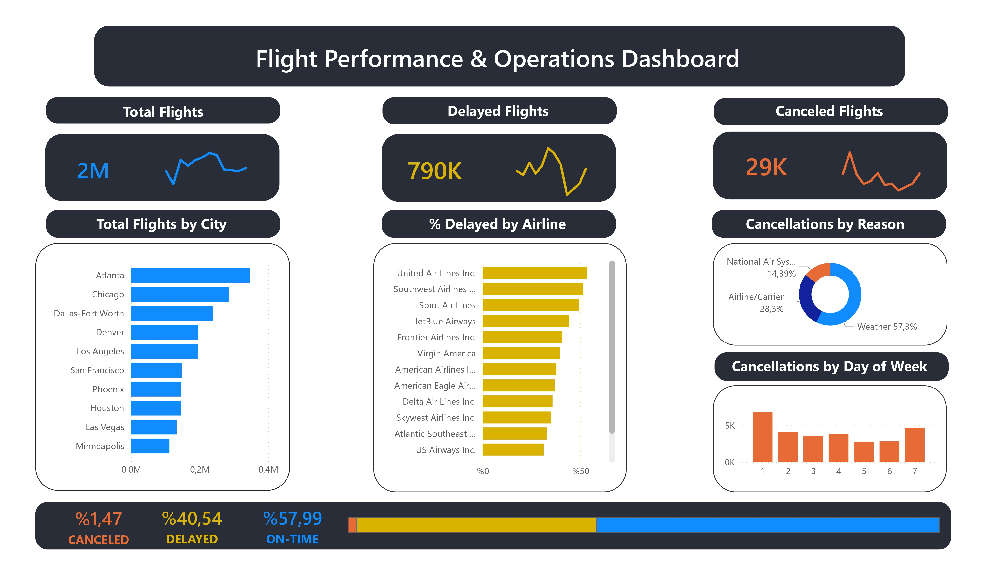

# Flight Performance & Operations Dashboard

An interactive Power BI dashboard designed to monitor flight operations, delay distributions, cancellation root causes, and airport traffic volume across major U.S. carriers.

## Executive Summary & Key Performance Indicators (KPIs)
- **Total Flights (2M):** Tracks overall flight volume with an integrated sparkline trend over time.
- **Delayed Flights (790K - 40.54%):** Monitors total delayed operations and historical fluctuation patterns.
- **Canceled Flights (29K - 1.47%):** Measures operational disruptions and cancellation volume trends.
- **Flight Status Ratio:** Provides an end-to-end breakdown across **On-Time (57.99%)**, **Delayed (40.54%)**, and **Canceled (1.47%)** flights.

## Business Insights & Visual Breakdowns
- **Traffic by Origin City:** Identifies top high-volume hubs led by Atlanta (>0.3M), Chicago, Dallas-Fort Worth, Denver, Los Angeles, and San Francisco.
- **Carrier Delay Performance (% Delayed by Airline):** Ranks airlines by delay percentage, highlighting carriers like United Airlines Inc. and Southwest Airlines at the top of delay ratios.
- **Cancellation Root Cause Analysis:** Donut chart breakdown categorizing operational cancellations into:
  - **Weather:** 57.3% (Primary disruption factor)
  - **Airline/Carrier Operations:** 28.3%
  - **National Air System (NAS):** 14.39%
- **Day-of-Week Operational Trends:** Highlights peak cancellation spikes occurring on Day 1 (Monday) and Day 7 (Sunday).

## Data Modeling & Technologies Used
- **Microsoft Power BI Desktop:** Interactive dashboard design, custom card visual containers, sparkline integrations, and KPI indicators.
- **DAX (Data Analysis Expressions):** Dynamic measures for on-time rates, delay percentages, and category distributions.
- **Power Query:** ETL processes, data transformation, and relationship schema between dimension and fact tables.

## Repository Structure
- `Flight_Performance_Operations_Dashboard.pbix`: Full interactive Power BI report with embedded data models.
- `Flight_Performance_Report.pdf`: Printable high-resolution export of the executive dashboard.
- `flight_dashboard_preview.jpg`: High-resolution preview image for direct visual portfolio display.
- `data/`: Contains dimension lookup datasets (`airlines.csv`, `airports.csv`, `cancellation_codes.csv`).
